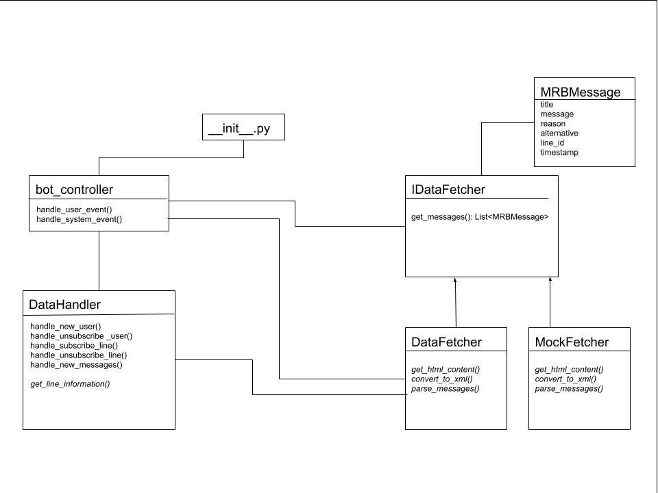

# MRB Akutmeldungen (inoffiziell)

Dieser Bot bietet die Möglichkeit Akutmeldungen der MRB zu Zugausfällen oder ähnlichem auf dem Smartphone zu empfangen.

Diese Nachrichten werden ohne Veränderung direkt von den Linienseiten der MRB übernommen (bspw. [Linie RE 3](https://www.mitteldeutsche-regiobahn.de/de/strecken/linienuebersicht-fahrplaene/linie/re-3-dresden-hof) und [Linie RE 6](https://www.mitteldeutsche-regiobahn.de/de/strecken/linienuebersicht-fahrplaene/linie/re-6-leipzig-chemnitz)).

Dies ist kein Angebot der MRB und hat auch keine Verbindungen zu dieser. 

## Benutzung

Der Bot kann über diesen Link abonniert werden: https://telegram.me/unofficial_mrb_bot

Mit `/start` kann der Bot abonniert werden und mit `/stop` kann das Abonnement beendet werden.

## ToDo

- [x] grundlegends Logging implementieren
- [x] Zugausfälle und Zugverspätungen erfassen
- [x] Bot abonnierbar machen
- [x] Persistenz für Abonnements einrichten
- [x] gleichzeitige Nachrichten zusammenfassen
- [x] Persistenz auf SQLite umstellen
- [ ] Abonnements für einzelne Linien ermöglichen
- [ ] Monatliche Reports erstellen

## Software Architektur

## Datenschutz

Der Bot speichert für die Zeitdauer des Abonnements die `chat_id` des Abonnements, aber keine anderen persönlichen Informationen.

Nachrichten an den Bot, die nicht zu den definierten Kommandos gehören, werden ohne Angabe des Senders in der Log gespeichert. Dies dient der Fehlerbehebung.
